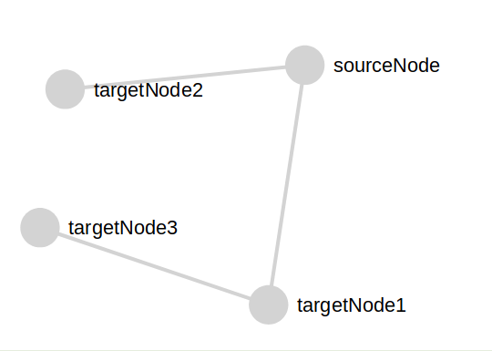

A React app to create Network graph using JSON data

The working example is shown here: https://eiranling.github.io/json-to-graph

## How to use:

To use the app, simply enter JSON data on the left hand box in the correct format. 
For now, the box accepts any JSON data, but the page will only work with data formatted like the following:
`
{
"sourceNode": {"targetNode1": {}, "targetNode2": {} },
"targetNode1": {"targetNode3": {} }
}
`

This will result in the following output:
